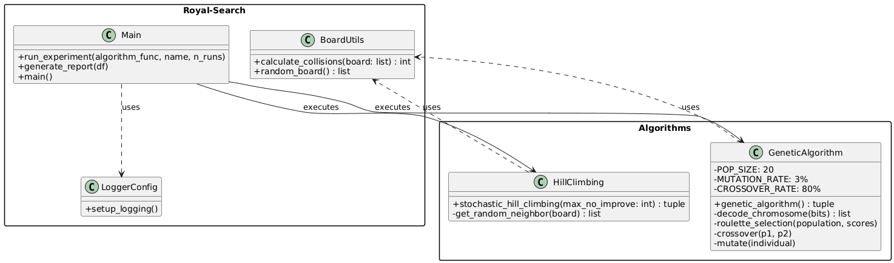
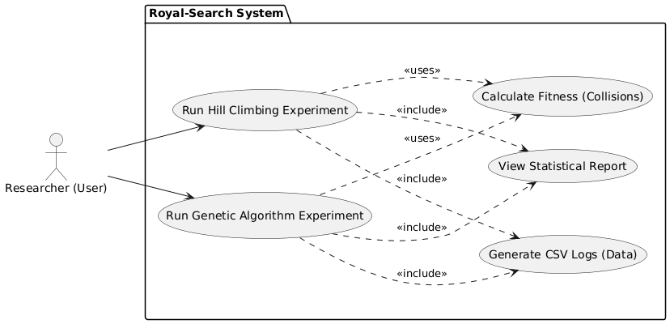
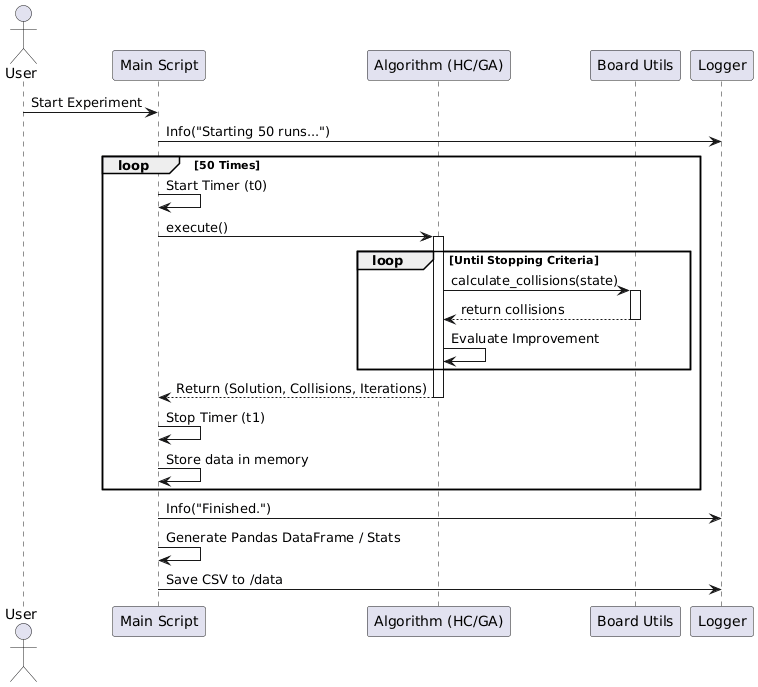
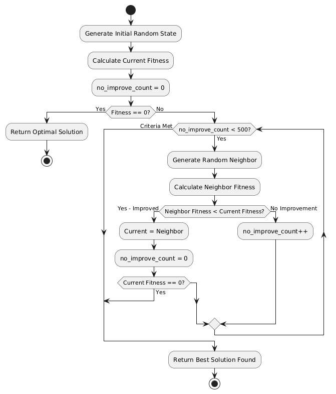
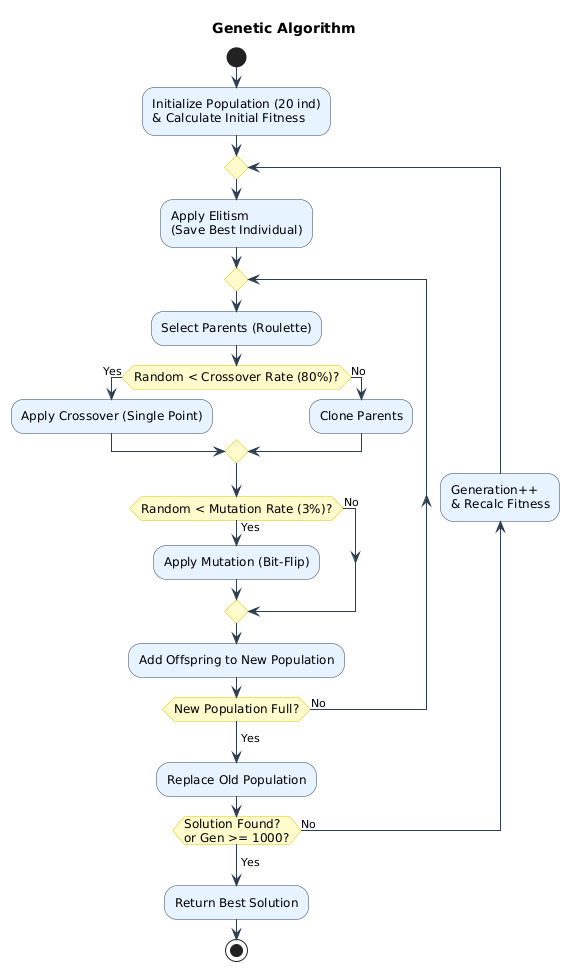

# Royal-Search: N-Queens Optimization Suite


> A robust, data-driven approach to solving the 8-Queens Problem using Local Search and Evolutionary Computation algorithms.


## Description

**Royal-Search** (internally configured as `stochastic-hill-climbing`) is a structured implementation of optimization algorithms designed to solve the classic **8-Queens Problem**. This project was developed as an evaluation requirement for the Artificial Intelligence course at the **Federal University of Pará (UFPA)**.

The goal is not only to find the solution but to statistically analyze the behavior of two distinct approaches:
1.  **Stochastic Hill Climbing**
2.  **Genetic Algorithm**

The project follows **MLOps** principles, utilizing **Poetry** for dependency management and virtual environment isolation, ensuring full reproducibility.


## Features

* **Modern Dependency Management:** Uses Poetry for version locking and environment isolation.
* **Centralized Logging:** Records every execution step in `data/logs/` and stdout.
* **Automated Reporting:** Collects runtime, iteration, and fitness metrics using `pandas` and `numpy`.
* **Top 5 Solutions:** Automatically identifies and reports the best distinct solutions found.

---

## Project Structure

```text
Royal-Search/
├── data/                  # Generated artifacts (ignored by Git)
│   ├── logs/              # Execution logs
│   └── *.csv              # Statistical result tables
├── docs/                  # UML Diagrams and documentation
├── src/                   # Main Source Code
│   ├── algorithms/        # Hill Climbing and Genetic Algorithm
│   ├── utils/             # Board and Fitness functions
│   ├── __init__.py        # Logger Configuration
│   └── main.py            # Experiment Orchestrator
├── pyproject.toml         # Dependency definitions (Poetry)
├── poetry.lock            # Lockfile for exact reproducibility
└── README.md
```

## Installation and Setup
This project uses Poetry for package management. Ensure you have Python 3.12+ installed.

1. Clone the repository:
```bash
git clone [https://github.com/Code-AldreySandre/Royal-Search.git](https://github.com/Code-AldreySandre/Royal-Search.git)

cd Royal-Search
```

2. Install Poetry (if not already installed):
```bash
pip install poetry
```

3. Install project dependencies:
```bash
poetry install
```

4. Run the experiments

  - To run the experiments, use the **poetry run** command, which ensures execution within the isolated virtual enviroments:
  ```bash
  poetry run -m src.main
  ```

  - It's important to notice the detailed logs will be saved to **data/logs/app_execution.log**, and raw result datasets (CSV) will be saved to the **data/** directory

---
## Implemented algorithms

***1. Stochastic Hill Climbing***

A local search variant that accepts random neighbors if they improve fitness. The objective is to minimize collisions (0 is optimal). To reach it the **Stopping Criterion** is 500 consecutive iterations without improvement.

***2. Genetic Algorithm***

An evolutionary computation approach inspired by biological natural selection. This algorithm manages a population of **20 binary-encoded individuals** that evolve through generations using **Roulette Selection**, **Crossover** (80% rate), and **Mutation** (3% rate). To ensure the quality of the solution, Elitism is applied to preserve the best individual of each generation. The execution terminates when the optimal solution is found or the limit of 1000 generations is reached.

## Implementation

### 1. System Architecture (Class Diagram)

This diagram illustrates the modular organization of the Royal-Search project. The framework was designed to ensure low coupling and high cohesion, separating the orchestration logic (Main) from the algorithmic implementations and utilities.

**Main**: It acts as the central controller, responsible for configuring the experiments, instantiating the algorithms, and managing the collection of statistical metrics.

**Algorithms**: The package encapsulates search strategies. The GeneticAlgorithm class implements evolutionary logic (population, crossover, mutation), while HillClimbing focuses on stochastic local search.

**BoardUtils & Logger**:Support classes that provide, respectively, the fitness functions (collision calculation) and the log recording system.



## 2.User Interaction (Use Case Diagram)

The diagram below describes the functionalities accessible to the Researcher (system user). The focus is on the automated execution of test batteries.

The system allows independent execution of Hill Climbing and Genetic Algorithm experiments.

Thus, critical processes such as Log Generation (CSV) and Statistical Report Visualization are automatically triggered (<<"include">> relationships) with each execution, ensuring data persistence and results reproducibility.



## 3. Experimental Execution Flow (Sequence Diagram)

To meet the statistical requirements of the work (calculation of mean and standard deviation), the system does not execute the algorithm just once. The sequence diagram details the lifecycle of the run_experiment function:



1. The orchestrator starts a loop of 50 plays.

2. For each iteration, the time is clocked (Start Timer / Stop Timer) and the algorithm is executed until the stopping criterion is reached.

3. The raw data (solution, collisions, iterations and time) are stored in memory.

4. At the end of the loop, the data is consolidated into a Pandas DataFrame and exported to the /data folder.

## 4.Logic of Algorithms (Activity Diagrams)
As requested in items 1.a and 2.a of the project specification, the flowcharts below detail the internal decision making of each algorithm.

#### A) Stochastic Hill Climbing
This flow represents a local search with random neighborhood restart.

**Initial State**: A randomly generated board.

**Move Decision**: A neighbor is randomly generated. If it has fewer conflicts than the current state, the exchange is made.

**Stopping Criterion**: The algorithm terminates if it finds the optimal solution (0 collisions) or if it reaches the limit of 500 consecutive iterations without improvement (stagnation at local optimum).



#### B) Genetic Algorithm
This represents the evolutionary approach based on the strict parameters defined in the project.

**Initialization**: Population of 20 individuals with binary coding.

**Evolutionary Cycle**: At each generation, fitness is assessed. Elitism applies to preserve the best individual.

**Genetic Operators**: The new population is formed via Roulette Selection, Crossing (Rate of 80%) and Mutation (Rate of 3%).

**Stopping Criterion**: The cycle repeats until the optimal solution emerges or the limit of 1000 generations is reached.



## Author
<table>
  <tr>
      </a>
    </td>
    <td align="center">
      <a href="#" title="defina o título do link">
        <br>
        <sub>
          <b>Aldrey Sandre</b>
        </sub>
</table>

## Contato
For questions please contact:

- **Nome**: Aldrey Sandre
- **Email**: aldreycordeiro96@gmail.com
- **LinkedIn**: [Clique aqui!](www.linkedin.com/in/aldrey-sandre)